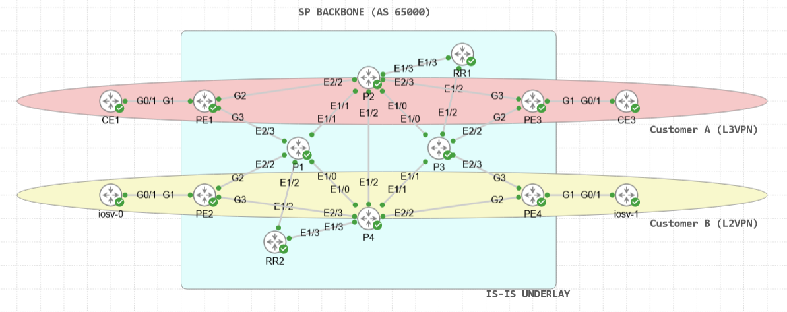

# Multi-Tenant Service Provider Architecture
### Cisco Modeling Labs (CML) | MPLS L3VPN + L2VPN Lab

---

## Overview

This lab simulates a **multi-tenant Service Provider (SP) network** built on an MPLS core, delivering two distinct VPN services simultaneously to different customer segments:

- **L3VPN (VRF-A)** — Layer 3 VPN using MP-BGP VPNv4 with route reflection, serving CE1 and CE3
- **L2VPN (VPLS)** — Layer 2 point-to-point pseudowire using LDP-signaled xconnect, serving CE2 (iosv-0) and CE4 (iosv-1)

The topology reflects a realistic SP core design with a redundant P-router mesh, dual Route Reflectors, and dedicated PE routers per service type.

---

## Topology

---

## Node Inventory

| Node | Platform | Role | Loopback |
|------|----------|------|----------|
| PE1 | CSR1000v (IOS-XE 17.3) | Provider Edge — L3VPN | 10.0.0.11 |
| PE2 | CSR1000v (IOS-XE 17.3) | Provider Edge — L2VPN | 10.0.0.12 |
| PE3 | CSR1000v (IOS-XE 17.3) | Provider Edge — L3VPN | 10.0.0.13 |
| PE4 | CSR1000v (IOS-XE 17.3) | Provider Edge — L2VPN | 10.0.0.14 |
| P1 | IOL-XE 17.12 | Provider Core | 10.0.0.1 |
| P2 | IOL-XE 17.12 | Provider Core | 10.0.0.2 |
| P3 | IOL-XE 17.12 | Provider Core | 10.0.0.3 |
| P4 | IOL-XE 17.12 | Provider Core | 10.0.0.4 |
| RR1 | IOL-XE 17.12 | BGP Route Reflector | 10.0.0.9 |
| RR2 | IOL-XE 17.12 | BGP Route Reflector | 10.0.0.10 |
| CE1 | IOSv 15.9 | Customer Edge — L3VPN | 192.168.1.1 |
| CE3 | IOSv 15.9 | Customer Edge — L3VPN | 192.168.3.1 |
| iosv-0 (CE2) | IOSv | Customer Edge — L2VPN | 192.168.100.1 |
| iosv-1 (CE4) | IOSv | Customer Edge — L2VPN | 192.168.100.2 |

---

## Architecture Deep Dive

### Underlay — IS-IS + LDP

All P, PE, and RR nodes participate in a single **IS-IS Level-2-only** domain (Area `49.0001`) with wide metrics. MPLS label distribution uses **LDP**, autoconfigured via IS-IS (`mpls ldp autoconfig`) with loopback-anchored router IDs (`mpls ldp router-id Loopback0 force`).

```
IS-IS NET format: 49.0001.0100.0000.00XX.00
SP AS Number:     65000
```

### BGP Control Plane — Dual Route Reflectors

Two Route Reflectors provide redundancy for the BGP control plane. All PE routers are clients of both RRs. The RRs peer with each other as non-clients.

```
RR1 (10.0.0.9)  ←→  RR2 (10.0.0.10)   [iBGP peer, non-client]
      ↕                    ↕
  PE clients           PE clients
(10.0.0.11–14)       (10.0.0.11–14)
```

**Address families active on RRs:**
- `address-family vpnv4` — for L3VPN route reflection

> **Note:** BGP `address-family l2vpn vpls` was intentionally removed from the RRs. IOL-XE does not reliably process or reflect L2VPN VPLS NLRIs. See [Known Limitations](#known-limitations).

---

### Service 1 — L3VPN (VRF-A)

A standard MPLS L3VPN connecting CE1 and CE3 via PE1 and PE3.

| Parameter | Value |
|-----------|-------|
| VRF Name | VRF-A |
| Route Distinguisher | 65000:1 |
| Route Target (import/export) | 65000:1 |
| CE1 BGP AS | 65100 |
| CE3 BGP AS | 65100 |
| PE-CE Protocol | eBGP with `as-override` |

**CE prefix advertisement:**
- CE1 advertises `192.168.1.0/24` → received by CE3 via VPNv4
- CE3 advertises `192.168.3.0/24` → received by CE1 via VPNv4

Both CEs are in AS 65100. The `as-override` knob on PE1 and PE3 prevents BGP AS-path loop rejection on the CE side.

**Verify L3VPN:**
```
CE1# ping 192.168.3.1 source GigabitEthernet0/1
PE1# show bgp vpnv4 unicast all
PE1# show ip route vrf VRF-A
```

---

### Service 2 — L2VPN (LDP Pseudowire / xconnect)

A point-to-point Layer 2 pseudowire between PE2 and PE4, presenting CE2 and CE4 as if they were on the same LAN segment.

| Parameter | Value |
|-----------|-------|
| VC ID | 200 |
| Signaling | LDP (targeted hello) |
| Encapsulation | MPLS |
| CE2 IP | 192.168.100.1/24 |
| CE4 IP | 192.168.100.2/24 |

**PE2 xconnect config:**
```
l2vpn xconnect context VPLS-B
 member GigabitEthernet1 service-instance 200
 member 10.0.0.14 200 encapsulation mpls
```

**PE4 xconnect config:**
```
l2vpn xconnect context VPLS-B
 member GigabitEthernet1 service-instance 200
 member 10.0.0.12 200 encapsulation mpls
```

**Verify L2VPN:**
```
PE2# show l2vpn xconnect
PE2# show mpls l2transport vc detail
CE2# ping 192.168.100.2 source GigabitEthernet0/1
```

---

## Address Plan

### Loopbacks
| Node | Address |
|------|---------|
| P1 | 10.0.0.1/32 |
| P2 | 10.0.0.2/32 |
| P3 | 10.0.0.3/32 |
| P4 | 10.0.0.4/32 |
| RR1 | 10.0.0.9/32 |
| RR2 | 10.0.0.10/32 |
| PE1 | 10.0.0.11/32 |
| PE2 | 10.0.0.12/32 |
| PE3 | 10.0.0.13/32 |
| PE4 | 10.0.0.14/32 |

### Core Links (IS-IS / LDP)
| Link | Subnet |
|------|--------|
| P1 ↔ P2 | 10.1.2.0/24 |
| P1 ↔ P4 | 10.1.4.0/24 |
| P2 ↔ P3 | 10.2.3.0/24 |
| P2 ↔ P4 | 10.2.4.0/24 |
| P3 ↔ P4 | 10.3.4.0/24 |
| RR1 ↔ P2 | 10.2.9.0/24 |
| RR1 ↔ P3 | 10.3.9.0/24 |
| RR2 ↔ P1 | 10.1.10.0/24 |
| RR2 ↔ P4 | 10.4.10.0/24 |
| PE1 ↔ P2 | 10.2.11.0/24 |
| PE1 ↔ P1 | 10.1.11.0/24 |
| PE2 ↔ P1 | 10.1.12.0/24 |
| PE2 ↔ P4 | 10.4.12.0/24 |
| PE3 ↔ P2 | 10.2.13.0/24 |
| PE3 ↔ P3 | 10.3.13.0/24 |
| PE4 ↔ P3 | 10.3.14.0/24 |
| PE4 ↔ P4 | 10.4.14.0/24 |

### PE-CE Links
| Link | Subnet | Service |
|------|--------|---------|
| PE1 ↔ CE1 | 192.168.11.0/24 | L3VPN |
| PE3 ↔ CE3 | 192.168.13.0/24 | L3VPN |
| PE2 ↔ CE2 | GigabitEthernet1 (untagged L2) | L2VPN |
| PE4 ↔ CE4 | GigabitEthernet1 (untagged L2) | L2VPN |

---

## Requirements

- **Cisco Modeling Labs (CML)** 2.x or later
- **Node images required:**
  - `csr1000v` — IOS-XE 17.3
  - `iol-xe` — IOS-XE 17.12
  - `iosv` — IOS 15.9
- Sufficient host resources: ~14 nodes active simultaneously

**Import the lab:**
1. Open CML and go to **Import**
2. Upload `Multi_Tenant_SP_Architecture.yaml`
3. Start all nodes and wait for IS-IS and LDP to converge (~2-3 minutes)
4. Verify with `show isis neighbors` and `show mpls ldp neighbor` on any P router

---

## Known Limitations

### IOL-XE and L2VPN VPLS BGP
IOL-XE (used for P routers and RRs) does **not reliably support** `address-family l2vpn vpls` BGP NLRI processing. During development, BGP sessions between IOL-XE RRs and CSR1000v PEs established successfully but exchanged zero L2VPN prefixes despite correct configuration. This is a platform limitation of IOL in CML, not a configuration error.

**Workaround applied:** L2VPN is implemented using **LDP-signaled xconnect** (`l2vpn xconnect`) directly between PE2 and PE4, bypassing BGP autodiscovery entirely. This provides equivalent point-to-point L2 connectivity without requiring RR involvement.

### IOS-XE 17.3 BGP AF Permit Check
IOS-XE 17.3 on CSR1000v has a known issue where `address-family l2vpn vpls` with BGP autodiscovery triggers an **AF Permit Check** that silently blocks outbound VPLS NLRIs even when the session is established. The LDP xconnect approach also bypasses this issue.

### Point-to-Point vs. Multipoint VPLS
The current L2VPN implementation is a **point-to-point pseudowire** between PE2 and PE4. True multipoint VPLS (with split-horizon forwarding across multiple PEs) would require either a working BGP autodiscovery setup or manual full-mesh pseudowire configuration across additional PE nodes.

---

## Troubleshooting Reference

### IS-IS / LDP not converging
```
# Check IS-IS adjacencies
P1# show isis neighbors

# Check LDP sessions
P1# show mpls ldp neighbor

# Verify loopback reachability
PE1# ping 10.0.0.13 source loopback 0
```

### L3VPN — CE not receiving routes
```
# Check VPNv4 BGP table on PE
PE1# show bgp vpnv4 unicast all

# Check VRF routing table
PE1# show ip route vrf VRF-A

# Check RR is reflecting routes
RR1# show bgp vpnv4 unicast all
```

### L2VPN — Pseudowire down
```
# Check xconnect state
PE2# show l2vpn xconnect

# Check VC label exchange
PE2# show mpls l2transport vc detail

# Check service instance
PE2# show ethernet service instance id 200 interface GigabitEthernet1 detail

# Verify LDP targeted hello
PE2# show mpls ldp neighbor detail | include Targeted|Peer
```

---

## What's Next

Planned enhancements for a future version of this lab:

- [ ] BFD on PE-CE links for fast failure detection
- [ ] QoS policy on PE uplinks
- [ ] Convergence/failover testing with link failure scenarios

---

## Author

Built and tested in Cisco Modeling Labs as part of SP networking study.  
Feedback and contributions welcome via Issues or Pull Requests.
